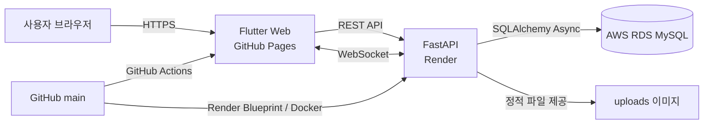

# 당근마켓 실시간 경매 개선 프로젝트

기존 중고거래 흐름에 실시간 경매를 결합한 미니 프로젝트입니다. 일반 판매와 경매 상품을 한 화면에서 탐색하고, 경매 등록부터 실시간 입찰·자동 연장·낙찰 후 거래 완료까지 이어지는 흐름을 구현했습니다.

### 팀원 및 담당 역할

| 이름 GitHub | 역할 | 주요 담당 |
| --- | --- | --- |
|강동주 [@aghose](https://github.com/soltyspring) | 팀장 / Full Stack | 실시간 경매 UI·API, 입찰 검증, 동시 입찰 처리, 자동 연장, 경매 상태 관리, 테스트, 웹·서버 배포 |
|최서윤 [@seoyooni](https://github.com/seoyooni) | Full Stack | 일반 상품 CRUD, 사용자·프로필, 판매 관리, 인증 세션, 상품·경매 페이지네이션, 낙찰 결과 처리 |
|이영민 [@ncs01060](https://github.com/ncs01060) | Full Stack | 초기 Flutter 화면과 휴대폰 인증 UI, 경매 등록·조회, 실시간 입찰과 WebSocket 연동 및 재동기화 |
|조서빈 [@lime06-20](https://github.com/lime06-20) | Frontend | 일반 상품 등록·상세 화면, 상품 이미지 업로드, Flutter Web 이미지 업로드 호환성 개선 |
|임지언 [@jiieon-lim](https://github.com/jiieon-lim) | Frontend / UI·UX | 서비스 화면 구성 및 UI 디자인, 프론트엔드 화면 구현 |

## 실행 링크

- 웹 서비스: https://starton-2026-team1.github.io/starton-team1-mini/
- API 문서: https://starton-team1-mini-api.onrender.com/docs
- GitHub: https://github.com/starton-2026-team1/starton-team1-mini

> Render 무료 인스턴스가 절전 상태인 경우 첫 요청에 수십 초가 걸릴 수 있습니다.

## 개선 배경

당근에서 물건을 판매하다 보면 며칠이 지나도 판매되지 않아 가격을 계속 내리거나 게시글을 끌어올리는 경우가 있습니다. 이때 높은 가격을 오래 기다리기보다 빠르게 처분하길 원하는 사용자가 효과적으로 상품을 판매할 수 있는 기능이 필요하다고 생각해 실시간 경매 기능을 만들었습니다.

## 주요 기능

### 경매

- 이미지·시작가·최소 입찰 단위·시작 및 종료 시각을 포함한 경매 등록
- 진행 전, 진행 중, 낙찰, 유찰, 취소, 거래 완료 상태 처리
- 경매 목록의 실시간 타이머와 종료·취소 상품 하단 정렬
- REST 응답과 WebSocket 메시지를 함께 사용한 입찰가 즉시 반영
- 판매자 본인 입찰, 부족한 금액, 동일 금액 입찰, 종료 경매 입찰 차단
- 종료 5분 이내 입찰 시 남은 횟수에 따른 5분 자동 연장
- 입찰 내역과 낙찰자 표시 및 판매자의 거래 완료 처리

### 일반 거래 및 사용자

- 휴대폰 번호 기반 간편 로그인과 자동 생성 닉네임
- 액세스·리프레시 토큰을 이용한 세션 유지
- 일반 상품 이미지 등록, 목록, 상세, 수정, 상태 변경, 삭제
- 일반 상품과 경매 상품을 함께 보여주는 통합 피드
- 판매 중, 경매 중, 완료 상태를 구분한 판매·경매 관리
- 프로필 조회와 닉네임 변경

## 아키텍처



백엔드는 API, 서비스, 저장소, 모델 계층을 분리했습니다. 경매 입찰은 서비스 계층에서 상태·권한·금액·자동 연장을 검증한 뒤 DB에 저장하고, 같은 결과를 WebSocket 구독자에게 전달합니다. 프론트엔드는 기능 단위로 화면, 모델, 컨트롤러, API 접근 코드를 분리했습니다.

## 기술 스택

| 영역 | 기술 |
| --- | --- |
| Frontend | Flutter 3.47, Dart 3.13, Material UI |
| 상태·저장 | ChangeNotifier, SharedPreferences, Flutter Secure Storage |
| 통신 | HTTP multipart/form-data, WebSocket |
| Backend | Python 3.13, FastAPI, Uvicorn, Pydantic |
| Database | AWS RDS MySQL, SQLAlchemy Async, asyncmy, Alembic |
| 인증 | JWT 액세스·리프레시 토큰 |
| 배포 | GitHub Pages, GitHub Actions, Render, Docker |
| 테스트 | pytest, Flutter Test |

## 프로젝트 구조

```text
mini/
├─ frontend/
│  ├─ lib/features/       # auction, auth, product, profile 등 기능 단위 코드
│  ├─ lib/shared/         # 네트워크, 테마 등 공통 코드
│  └─ test/               # 모델·컨트롤러·화면 테스트
├─ backend/
│  ├─ app/api/            # REST·WebSocket 라우터
│  ├─ app/services/       # 경매·상품·인증 비즈니스 규칙
│  ├─ app/repositories/   # SQLAlchemy 데이터 접근
│  ├─ app/models/         # DB 모델
│  ├─ app/schemas/        # 요청·응답 검증
│  ├─ alembic/            # DB 마이그레이션
│  └─ tests/              # API·서비스·저장소 테스트
├─ render.yaml            # Render 백엔드 배포 설정
└─ .github/workflows/     # Flutter Web 배포 자동화
```

## 로컬 실행

### Backend

`backend/.env.example`을 복사해 `backend/.env`를 만들고 실제 DB 주소와 JWT 비밀키를 입력합니다.

```powershell
cd backend
.\.venv\Scripts\python.exe -m alembic upgrade head
.\.venv\Scripts\python.exe -m uvicorn app.main:app --reload --port 8000
```

API 문서: http://127.0.0.1:8000/docs

### Frontend Web

```powershell
cd frontend
..\.runtime\flutter\bin\flutter.bat run -d chrome `
  --dart-define=API_BASE_URL=http://127.0.0.1:8000/api/v1
```

Android 에뮬레이터에서는 API 주소로 `http://10.0.2.2:8000/api/v1`을 사용합니다.

## 테스트

```powershell
cd backend
.\.venv\Scripts\python.exe -m pytest -q

cd ..\frontend
..\.runtime\flutter\bin\flutter.bat test
..\.runtime\flutter\bin\flutter.bat analyze
```

주요 테스트 범위는 인증과 권한 오류, 상품 CRUD, 경매 상태 전환, 입찰 금액 검증, 본인 입찰 차단, 자동 연장, 낙찰자 확정, WebSocket 메시지, 목록 페이지네이션, 세션 복원입니다.

## 제출용 이미지 반영

제출용 이미지는 `backend/uploads/`에 넣고 DB의 `product_images.image_url`을 `/static/uploads/파일명` 형식으로 맞춥니다. 이미지 파일을 `main` 브랜치에 커밋하면 Docker 이미지에 포함되어 Render 재배포 직후 제공됩니다.

```text
backend/uploads/example.jpg
DB image_url: /static/uploads/example.jpg
```

무료 Render 인스턴스의 실행 중 업로드 파일은 재배포 시 사라질 수 있으므로, 제출용 고정 이미지는 반드시 저장소에 커밋합니다. 실제 운영 환경에서는 S3 같은 객체 스토리지 사용이 적합합니다.

## 배포

- `main` 푸시 시 GitHub Actions가 Flutter Web을 빌드해 GitHub Pages에 배포
- Render Blueprint가 `main` 변경을 감지해 Docker 백엔드를 자동 배포
- Docker 시작 시 `alembic upgrade head` 실행 후 FastAPI 기동
